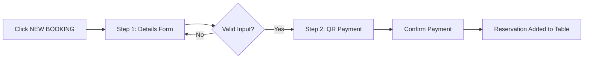

<](https://react.dev)
[](https://vitejs.dev)
[](https://tailwindcss.com)
[](https://zustand-demo.pmnd.rs)
[](https://www.framer.com/motion)
[](https://leafletjs.com)

---

**Bhopal Digital Twin** is a premium, glassmorphic command center dashboard that provides a real-time digital replica of Bhopal's urban infrastructure. Built for Smart City administrators and citizens, it covers traffic intelligence, weather monitoring, smart parking management, environmental analytics, predictive AI, and more — all in a cinematic, dark-mode interface.

</div>

---

## ✨ Key Features

### 🎛️ Command Center Dashboard
- **Glassmorphic UI** with a "Midnight Slate" design language
- Real-time sector-level navigation (Overview, Traffic, Safety, Utilities)
- Live data feed ticker, safety matrix scoring, and temperature monitoring
- Responsive layout optimized for 1080p+ displays

### 🗺️ Interactive City Map
- **Leaflet-powered** satellite map of Bhopal with real-time overlays
- Custom animated map pins for traffic hotspots, sensors, and infrastructure
- Layer toggling for different data visualizations

### 🅿️ Smart Parking Module (Full-Featured)
- **Role-Based Access Control** — Admin and User interfaces with distinct feature sets
- **Multi-Step Booking System:**
  - Step 1: Vehicle number, Slot ID, recommended empty slots, check-in time, duration selector, live pricing (₹25/hr)
  - Step 2: Secure Checkout with UPI QR code payment gateway
  - Step 3: Instant reservation confirmation with real-time table update
- **3D Tactical Slot Map** — Interactive perspective-rendered parking grid with tilt/rotation controls
- **Slot Allocation Grid** — Color-coded (Free / Busy / Reserved) visual allocator
- **Standard Pricing Card** — Hourly rate, pre-booking fee, grace period display
- **Regional Parking Explorer** — Multi-state, multi-city parking lot browser (Bhopal, Indore, Mumbai)
- **Financial Hub** — Transaction history with UPI/Card payment tracking
- **Revenue Analytics** — Weekly performance charts with area graphs
- **Worker Performance** — Staff ratings and customer feedback tracking
- **Customer Complaints** — Issue tracker with resolution status
- **User Management** — Role-based user table with avatar, status, and access controls
- **Emergency Lockdown Protocol** — One-click facility lockdown with visual alerts
- **Tactical OCR Stream** — Real-time system log console

### 🌦️ Atmosphere AI (Weather Intelligence)
- Live weather data integration via OpenWeatherMap API
- Dynamic animated weather backgrounds (rain, clouds, sun, snow, thunderstorm)
- 5-day forecast, humidity, wind speed, UV index, and air quality panels
- Sunrise/sunset tracking with golden hour indicators

### 📊 Analytics & Intelligence Panels
- **Overview Panel** — City-wide KPIs and sector health monitoring
- **Traffic Panel** — Real-time congestion analysis and flow optimization
- **Safety Panel** — Incident tracking and emergency response metrics
- **Utilities Panel** — Water, electricity, and gas infrastructure monitoring
- **Environmental Panel** — Pollution levels, green coverage, and carbon metrics
- **Predictive AI Panel** — ML-powered forecasting for urban trends
- **Asset Grid Panel** — Infrastructure asset inventory and health tracking
- **Logistics Panel** — Supply chain and municipal logistics monitoring

---

## 🏗️ Architecture

```
bhopal-digital-twin/
├── public/                     # Static assets
├── src/
│   ├── components/
│   │   ├── layout/             # App shell components
│   │   │   ├── TopBar.jsx      # Header with role switcher (Admin/User)
│   │   │   ├── Sidebar.jsx     # Navigation sidebar with sector links
│   │   │   └── BottomTicker.jsx# Real-time scrolling data ticker
│   │   ├── map/                # Map components
│   │   │   ├── BhopalMap.jsx   # Leaflet map container
│   │   │   └── MapPin.jsx      # Animated custom map markers
│   │   ├── panels/             # Feature panels (10 modules)
│   │   │   ├── SmartParkingPanel.jsx   # 🅿️ Full parking management system
│   │   │   ├── WeatherFullPanel.jsx    # 🌦️ Weather intelligence dashboard
│   │   │   ├── OverviewPanel.jsx       # 📊 City overview KPIs
│   │   │   ├── TrafficPanel.jsx        # 🚗 Traffic flow analytics
│   │   │   ├── SafetyPanel.jsx         # 🛡️ Safety & incident tracking
│   │   │   ├── UtilitiesPanel.jsx      # ⚡ Utility infrastructure
│   │   │   ├── EnvironmentalPanel.jsx  # 🌿 Environmental metrics
│   │   │   ├── PredictiveAIPanel.jsx   # 🤖 AI forecasting
│   │   │   ├── AssetGridPanel.jsx      # 📦 Asset management
│   │   │   └── LogisticsPanel.jsx      # 🚛 Logistics tracking
│   │   └── ui/                 # Shared UI primitives
│   │       ├── GlassPanel.jsx  # Glassmorphic card component
│   │       └── WeatherBackground.jsx   # Dynamic weather animations
│   ├── store/
│   │   └── cityStore.js        # Zustand global state (navigation, roles, data)
│   ├── App.jsx                 # Root application component
│   ├── main.jsx                # React entry point
│   └── index.css               # Global styles & Tailwind config
├── .env                        # API keys (OpenWeatherMap)
├── package.json
├── vite.config.js
└── README.md
```

---

## 🛠️ Tech Stack

| Layer | Technology | Purpose |
|-------|-----------|---------|
| **Framework** | React 19 | Component architecture |
| **Build Tool** | Vite 8 | Dev server & HMR |
| **Styling** | Tailwind CSS 4 | Utility-first CSS |
| **State** | Zustand 5 | Global state management |
| **Animations** | Framer Motion 12 | Page transitions & micro-animations |
| **Maps** | Leaflet + React-Leaflet | Interactive city map |
| **Charts** | Recharts 3 | Data visualization (Area, Pie, Bar) |
| **Icons** | Lucide React | 50+ premium SVG icons |
| **Weather API** | OpenWeatherMap | Live weather data |

---

## 🚀 Quick Start

### Prerequisites
- **Node.js** ≥ 18.x
- **npm** ≥ 9.x

### Installation

```bash
# Clone the repository
git clone https://github.com/your-username/bhopal-digital-twin.git
cd bhopal-digital-twin

# Install dependencies
npm install

# Configure environment variables
# Create a .env file with your OpenWeatherMap API key:
# VITE_OPENWEATHER_API_KEY=your_api_key_here

# Start development server
npm run dev
```

The app will be available at `http://localhost:5176/`

### Build for Production

```bash
npm run build
npm run preview
```

---

## 🔐 Role-Based Access Control

The dashboard supports two distinct interfaces:

### 👤 User Mode
| Feature | Access |
|---------|--------|
| Dashboard with Quick Book | ✅ |
| Live Map | ✅ |
| Reservations + Booking | ✅ |
| Payments | ❌ |
| Reports | ❌ |
| Revenue Analytics | ❌ |
| User Management | ❌ |
| Emergency Lockdown | ❌ |

### 🛡️ Admin Mode
| Feature | Access |
|---------|--------|
| All User features | ✅ |
| Financial Hub (Payments) | ✅ |
| Worker & Complaint Reports | ✅ |
| Revenue Analytics & Charts | ✅ |
| User Management Table | ✅ |
| Emergency Lockdown Protocol | ✅ |

Toggle between roles using the **User / Admin** switch in the top-right corner of the dashboard.

---

## 🅿️ Booking Flow



**Step 1 — Book Your Space**
- Enter vehicle number (e.g., `MP04-BH-1234`)
- Select slot from recommended chips or type manually
- Choose duration (1h / 2h / 4h / 8h)
- View live pricing (₹25/hr base rate)

**Step 2 — Secure Checkout**
- Scan UPI QR code for payment
- Verified payment gateway integration

**Step 3 — Confirmation**
- Booking instantly appears in Recent Activity table with "Confirmed" status

---

## 🎨 Design Language

- **Theme:** Midnight Slate (dark mode with glassmorphism)
- **Primary Accent:** Neon Cyan (`#00f5ff`)
- **Success:** Neon Green (`#10b981`)
- **Warning:** Neon Yellow (`#fbbf24`)
- **Danger:** Neon Red (`#ef4444`)
- **Typography:** System font stack with monospace accents for data displays
- **Border Radius:** 2rem–2.5rem for cards, 1rem for buttons
- **Effects:** Backdrop blur, subtle glow shadows, smooth transitions

---

## 📄 Environment Variables

| Variable | Description | Required |
|----------|------------|----------|
| `VITE_OPENWEATHER_API_KEY` | OpenWeatherMap API key for live weather data | Yes |

---

## 🤝 Contributing

1. Fork the repository
2. Create a feature branch (`git checkout -b feature/amazing-feature`)
3. Commit your changes (`git commit -m 'Add amazing feature'`)
4. Push to the branch (`git push origin feature/amazing-feature`)
5. Open a Pull Request

---

## 📝 License

This project is built for educational and demonstration purposes as part of the **Smart City Initiative — Bhopal**.

---

<div align="center">

**Built with ❤️ for smarter cities**

*Bhopal Digital Twin — Where Urban Intelligence Meets Design Excellence*

</div>
]]>
